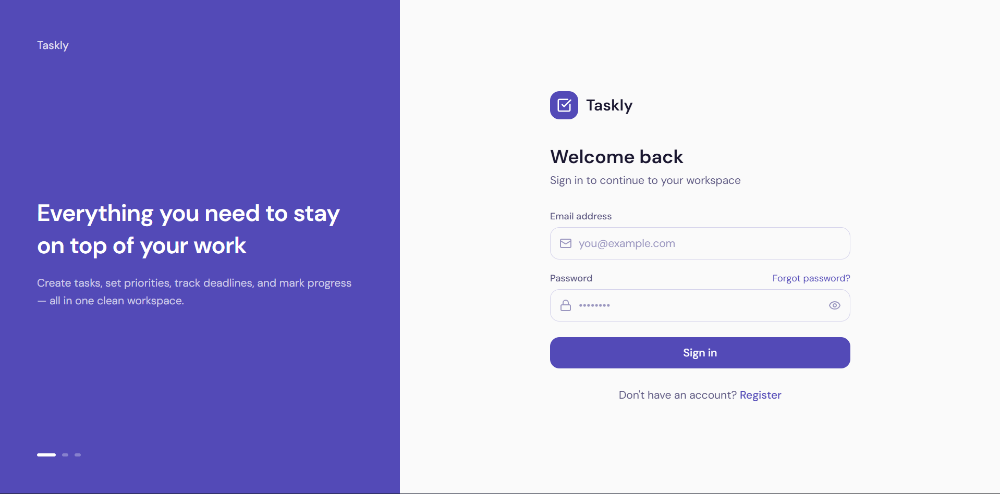
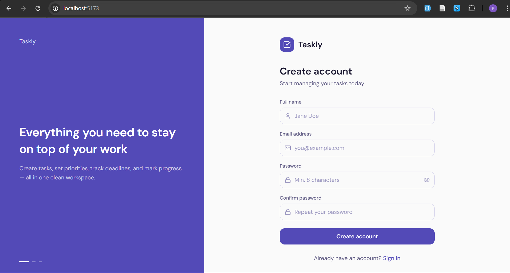
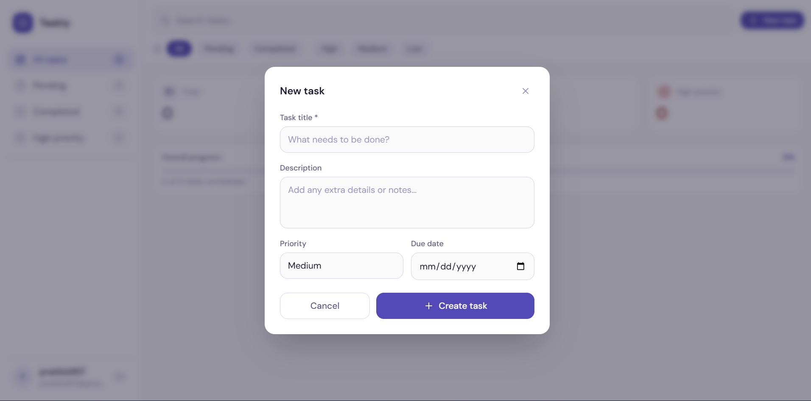
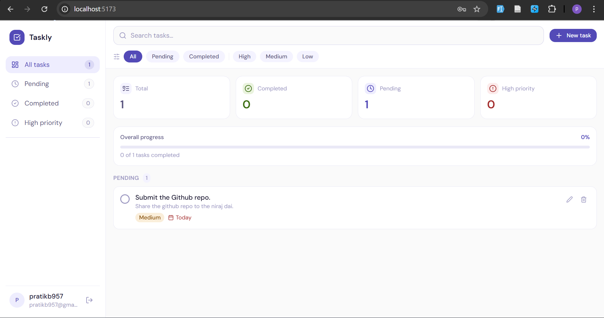
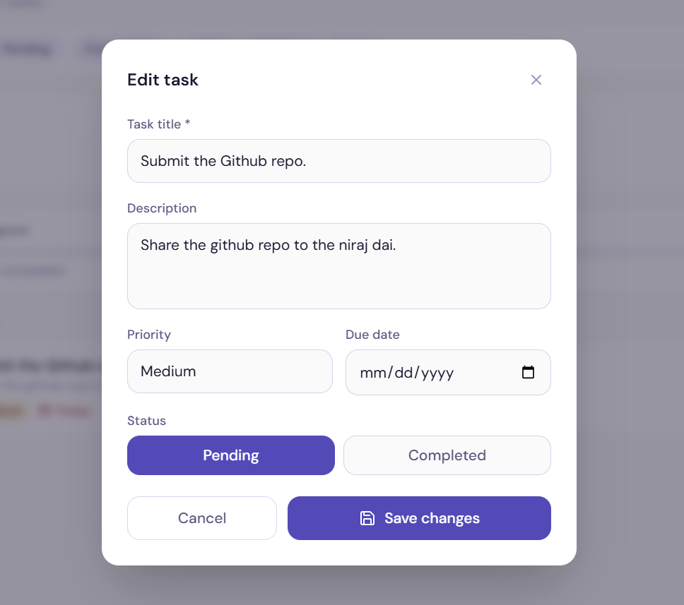
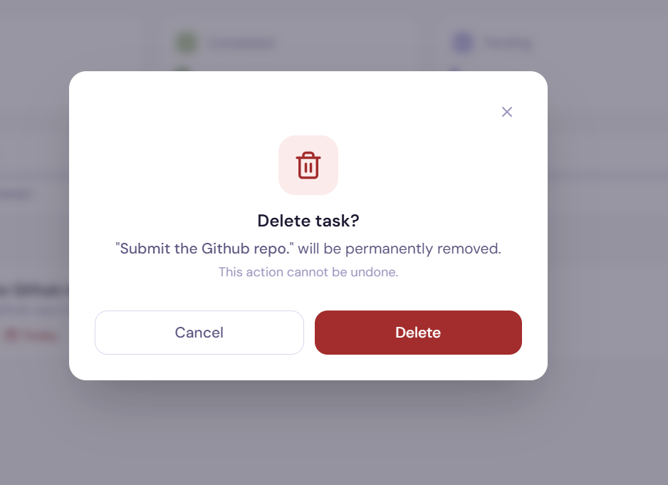
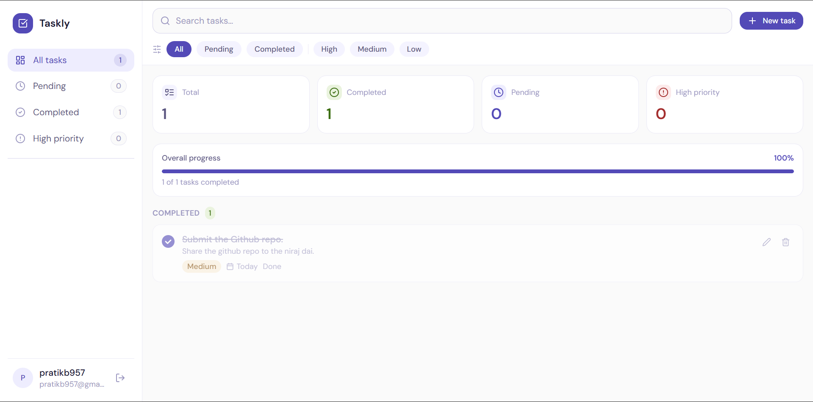

#  Taskly - Full-Stack Task Management

Taskly is a modern, full-stack TO-DO application designed for productivity. It features a high-performance React frontend and a secure Node.js/Express backend, integrated with PostgreSQL for robust data persistence.

---

##  Project Overview
Taskly provides a seamless experience for managing daily tasks. With a focus on security and speed, users can securely register, login, and manage their personal workspace with real-time updates powered by React Query.

## Technologies Used

### Frontend
- **Framework**: React + Vite
- **State Management**: Zustand
- **Data Fetching**: TanStack Query v5
- **Styling**: Tailwind CSS
- **Icons**: Lucide React

### Backend
- **Runtime**: Node.js
- **Language**: TypeScript
- **Framework**: Express.js
- **ORM**: Sequelize
- **Database**: PostgreSQL
- **Authentication**: JWT & Bcryptjs

---

## Features Implemented

- ** Secure Authentication**: Full sign-up and login flow with JWT stored securely and hashed passwords.
- ** Task CRUD**: Create, Read, Update, and Delete tasks with ease.
- ** Real-time Sync**: Instant UI updates using React Query's mutation and invalidation system.
- ** Priority & Status**: Categorize tasks by priority (Low, Medium, High) and track status (Pending, Completed).
- ** Responsive Design**: Fully optimized for both desktop and mobile viewports.
- ** Smart Filtering**: Quickly view tasks based on their status or priority level.

---

## Setup and Installation

### 1. Prerequisites
- Node.js (v18+)
- PostgreSQL Database (Local or Hosted like Neon/Render)
- npm or yarn

### 2. Backend Setup (`/TO-DO`)
```bash
# Navigate to backend directory
cd TO-DO

# Install dependencies
npm install

# Create .env file
 .env
```
Add your environment variables to `.env` (see section below).

### 3. Frontend Setup (`/taskly-frontend`)
```bash
# Navigate to frontend directory
cd taskly-frontend/taskly

# Install dependencies
npm install

# Start development server
npm run dev
```

---

## Environment Variables

### Backend (`.env`)
```env
DATABASE_URL=postgresql://<user>:<password>@<host>/<database>?sslmode=require
JWT_SECRET=your_jwt_secret_key
PORT=5000
```

---

## Database Setup
The project uses Sequelize with **Automatic Synchronization**.
- No manual migration steps are required for the initial setup.
- The server will automatically sync models to the database on startup using `sequelize.sync({ alter: true })`.
- Ensure your `DATABASE_URL` is correctly configured in the backend `.env`.

---

##  API Documentation

### Base URL: `http://localhost:5000/api/auth`

| Endpoint | Method | Auth | Description |
| :--- | :--- | :--- | :--- |
| `/register` | POST | ❌ | Create a new user account. |
| `/login` | POST | ❌ | Authenticate user & get JWT token. |
| `/getAllTask` | GET | ✅ | Retrieve all tasks for the user. |
| `/createTask` | POST | ✅ | Add a new task to the list. |
| `/updateTask` | PUT | ✅ | Update details of an existing task. |
| `/deleteTask` | DELETE | ✅ | Permanently remove a task. |
| `/toggleStatus` | PUT | ✅ | Switch between Pending/Completed. |

### Auth Header
All protected routes (✅) require the following header:
```json
{
  "Authorization": "Bearer <YOUR_TOKEN>"
}
```

---

## Frontend Usage Guide

1. **Authentication**: Start by registering a new account or logging in with existing credentials.
2. **Creating Tasks**: Click the "Add Task" button, fill in the title, priority, and due date.
3. **Managing Status**: Use the checkbox next to any task to toggle its completion status.
4. **Editing**: Click on a task card edit button to open the edit modal and update the details.
5. **Filtering**: Use the sidebar to filter tasks by status (Pending/Completed) or view high-priority items.

---

## Demo & Screenshots










---

